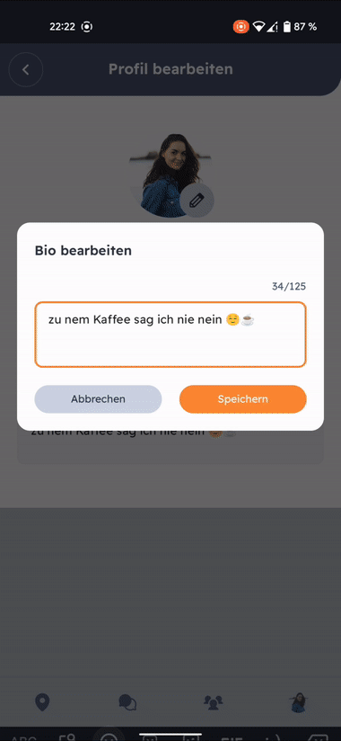

# Course Matcher - Meet me if you can!

Lerne CourseMatcher anhand unseres [kurzen Videos](readme_resources/course-matcher-video.mp4) kennen!

Während der Corona-Pandemie wurde der reguläre Vorlesungsbetrieb von Präsenz auf digitale Formate umgestellt. Dadurch gingen spontane Treffen, die sonst in den Räumlichkeiten der Universität, wie den Cafeterien, stattfanden, verloren. Mit dem jetzt wieder aufgenommenen Präsenzbetrieb werden Treffen nun wieder häufiger vereinbart. Oftmals werden hierzu aber bestehende Benachrichtigungsdienste wie WhatsApp oder Telegram verwendet, wodurch es notwendig ist, mehrere Nachrichten hin- und herzuschicken, um einen geeigneten Termin zu finden und einen Treffpunkt zu vereinbaren. Dies führt dazu, dass
vorgeschlagene Treffen unter anderen Nachrichten leicht verloren gehen.

Die App CourseMatcher soll alte
Freundschaften und Treffen mit Kommiliton:innen einfach, spontan und effizient in ungezwungener Atmosphäre
wieder ermöglichen.

Die App richtet sich an vorrangig an Studierende, aber auch an alle anderen, die schnell und einfach Treffen mit ihren Freunden vereinbaren wollen!

# Course Matcher - Die App

## Freunde
Füge deine Freunde einfach zu deiner Freundesliste hinzu, um sie zu Treffen einzuladen und ihre Verfügbarkeit und ihren Standort einsehen zu können.

Nimm Freundschaftsanfragen deiner Freunde an, lehne sie ab oder lösche sie, wenn du sie nicht mehr in deiner Übersicht haben möchtest.

## Meetups
Erstelle Meetups mit nur wenigen Klicks, indem du einfach einen Ort auf der Karte auswählst, die Uhrzeit festlegst und Freunde aus deiner Freundesliste einlädst.

Verschaffe dir einen Überblick über deine anstehenden Treffen und checke aus, wer zugesagt hat und wer es leider nicht schafft.

Du möchtest noch mehr Freunde einladen? Kein Problem. Und auch wenn du mal etwas später kommst, kannst du deinen Freunden ganz einfach bescheid geben!

Wurdest du zu einem Treffen eingeladen, kannst du wie bei den Freundschaftsanfragen einfach zusagen, absagen oder die Anfrage löschen.

## Karte - Freunde und Meetups auf einen Blick
Auf der Karte hast du aktive Meetups und den Standort deiner Freunde auf einen Blick.

Von hier kannst du auch direkt einen Freund zu einem Treffen einladen.

Zentriere deine Sicht auf deinen Standort oder wähle aus, ob deine Freunde deinen Standort gerade einsehen können.

## Profile
Lerne jeden User anhand des Profils besser kennen! Bearbeite dein Profil und ändere deinen Verfügbarkeitsstatus, damit deine Freunde einschätzen können, ob du gerade Zeit für ein Treffen hast.

## Her damit
Lade dir die aktuelle Release-Version hier herunter und lade die APK-Datei auf dein Telefon. Erlaube die Installation von Anwendungen von unbekannten Entwicklern auf deinem Smartphone und öffne dort die Datei zur Installation. Jetzt musst du dir nur noch einen Account erstellen und ein Profil anlegen und schon gehts los!

# Course Matcher - Das Team
Klare Aufgabenteilung gab es nicht. Jeder packt an, wo es gerade hakt und ordnet sich selbstständig Tickets zu, bevor diese fürs Review an die anderen weitergegeben werden.
## Markus Bink
Map, Design, Profil, Softwarearchitektur, Firebase, UI
## Martina Emmert 
Requests, LiveData, Meetup UI, Registrierung, Firebase, UI
## Nicole Schönwerth
Meetups, Onboarding, Verfügbarkeit, Firebase, UI
## Erik Blank
MeetupRequests, FriendRequest, Firebase, UI
## Michael Schmidt
Setup, Meetups, Firebase, UI
